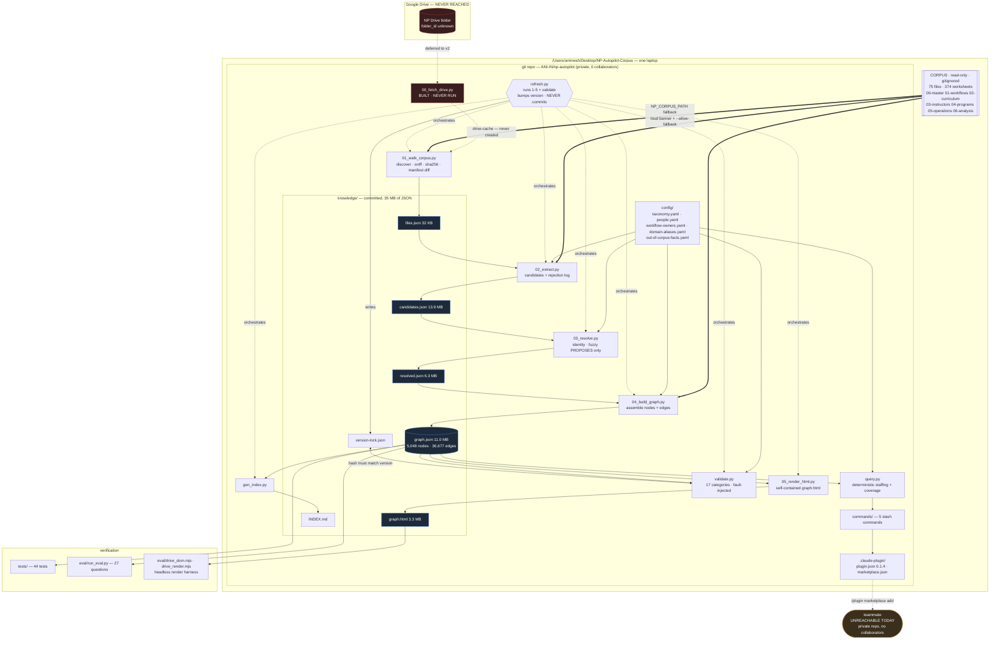

# AUDIT — np-autopilot, current state

**Phase 0 deliverable. No production code written.**

Audited 2026-09-16 against `main` at `ebddfc5`. Everything below was measured on
this machine, not read out of a doc. Where a number comes from a project
document rather than a measurement I say so.

**Verified during this audit:**

| check | result |
|---|---|
| `python3 -m pytest tests -q` | **44 passed** in 8.35s |
| `python3 eval/run_eval.py` | **25/27**, 0 fabrications (20/22 original, 5/5 fresh, 4/4 unanswerable) |
| `git status` | clean before and after |
| git history secret scan | **no secret has ever been committed** — detail in §5 |
| graph load + traversal | 5,048 nodes / 36,677 edges, `graph.json` 11.0 MB |

I did **not** run `pipeline/refresh.py` — it rewrites `graph.json`, bumps
`plugin.json` and appends to `BUILD_LOG.md`. Nothing in this audit needed it.

---

## 1 · System diagram — as it is today

**The single most important structural fact:** the git repo lives *inside* the
read-only corpus mirror. `pipeline/lib/paths.py` sets
`DEFAULT_CORPUS_PATH = REPO_ROOT`, and `.gitignore` excludes the seven corpus
directories. `01_walk_corpus.py` then has to explicitly skip its own repo
(`SKIP_DIRS`, `OWN_DOCS`) to avoid ingesting itself — and has twice failed to,
caught both times by the file-count check. `docs/` is already in `SKIP_DIRS`, so
this file does not pollute the walk.

---

## 2 · Component inventory

Status vocabulary: **solid** = working, tested, load-bearing · **fragile** =
working but with a known sharp edge · **stub** = exists, never exercised ·
**dead** = present and wrong or unused.

| Component | Lines | Status | Notes |
|---|---:|---|---|
| `config/taxonomy.yaml` | 771 | **solid** | Single source of truth for every type string. Enforced by a grep test. Also carries ~300 lines of decision rationale — it is documentation as much as config. |
| `pipeline/lib/taxonomy.py` | 203 | **solid** | Only module permitted to read the above. `edge_for_role()` keeps edge names out of code. |
| `pipeline/lib/paths.py` | 41 | **solid** | Only place a corpus path resolves. `NP_CORPUS_PATH` env override. |
| `pipeline/lib/resolve.py` | 94 | **solid** | One name-resolution rule. `Ambiguous` is the default return, never collapsed. Three shipped bugs had the shape this prevents. |
| `pipeline/lib/sources.py` | 321 | **solid** | Hand-written registry of sheet→column→type. Deliberately not discovery. |
| `pipeline/01_walk_corpus.py` | 332 | **solid** | Magic-byte sniffing, sha256 manifest, read-only assertion, add/change/remove diff with correct severities. |
| `pipeline/02_extract.py` | 955 | **fragile** | Correct, but the largest and least modular file. 11 bespoke extractors, each keyed to one sheet's layout. Any corpus layout change lands here. |
| `pipeline/03_resolve.py` | 318 | **solid** | Deterministic ids; fuzzy matching proposes only. Proven byte-identical across runs by test. |
| `pipeline/04_build_graph.py` | 464 | **fragile** | Assembly is sound, but it re-opens the owners workbook itself rather than consuming pass-2 output, so it needs the corpus at build time. Also the source of the `node_counts` defect (§6). |
| `pipeline/05_render_html.py` | 283 | **fragile** | Works; contains three copy-pasted duplicate blocks (`erows`/`themes`/`type_boxes` computed three times). Emits a 3.3 MB single file. |
| `pipeline/lib/render_logic.py` | 490 | **solid** | Pure logic as a string, inlined into HTML *and* written to `.mjs` so the headless harness executes shipped code. One definition, two consumers. |
| `pipeline/validate.py` | 298 | **solid** | 17 categories, each proven to fire by deliberate corruption. Aggregates rather than enumerates (CLAUDE.md §5). Enforces the version bump. |
| `pipeline/query.py` | 181 | **solid** | Deterministic tiering in Python so an LLM cannot re-rank it. Loads the whole 11 MB graph at import time. |
| `pipeline/refresh.py` | 167 | **solid** | Runs 1–5 + validate, prints a delta, bumps version, **stops without committing**. |
| `pipeline/gen_index.py` | 76 | **fragile** | Right idea (never hand-write counts) — currently emits one wrong count (§6.1). |
| `pipeline/00_fetch_drive.py` | 377 | **stub** | Complete and careful — native-export map, shortcut/cycle handling, empty-enumeration fatal, 404 probe. **Has never been run.** No `config/drive.yaml` exists. |
| `pipeline/gen_workflow_owners.py` | 110 | **solid** | One-shot generator. Every suggestion lands `confirmed: false`. |
| `commands/*.md` | 134 | **solid** | 5 commands. `staffing` and `coverage` shell out to `query.py`; `workflow`, `domain-owner`, `setup` read `graph.json` directly. |
| `.claude-plugin/` | 2 files | **fragile** | Valid manifests. But the repo is private with no collaborators, so **no teammate can install it today**. |
| `tests/` | 393 | **solid** | 44 tests, 8.4s. Covers determinism, taxonomy single-source, validation-category firing, staffing tier separation. |
| `eval/run_eval.py` | 401 | **solid** | 27 retrieval questions incl. 4 that pass only by refusing to answer. Fabrication scored worse than failure. |
| `eval/drive_*.mjs` | 319 | **solid** | Headless DOM + render harness. Node, no `package.json`. |
| `knowledge/*.json` | 35 MB | **fragile** | Build output committed to git. See §6.5. |
| `pipeline/README.md` | 20 | **dead** | Says passes 1–5 are "**not built**". All five are built and shipping. |
| `skills/` | 0 | **dead** | Empty directory. |
| `config/domain-aliases.PROPOSED.yaml` | — | **dead** | Added then removed in history. Not present now. |
| CI / IaC / deploy config | 0 | **absent** | No `.github/`, no workflow, no Dockerfile, no Terraform, no `vercel.json`. |
| Dependency manifest | 0 | **absent** | No `requirements.txt`, `pyproject.toml` or `package.json`. Deps are implicit: `openpyxl`, `PyYAML`, `python-docx`, `pytest`, plus `google-api-python-client` / `google-auth-oauthlib` for the unused pass 0. |

---

## 3 · The graph data model, written out explicitly

### 3.1 Storage

Plain JSON files on disk. There is no database, no SQLite, no server. Everything
is one process reading one file.

| File | Size | Role | Committed |
|---|---:|---|---|
| `knowledge/files.json` | 32 KB | pass-1 manifest: path, sha256, bytes, mtime, sniffed kind, parsed, sheet names | yes |
| `knowledge/candidates.json` | 13.9 MB | pass-2 output: candidates, `teaches_pairs`, `expertise_claims`, `confirmations`, `blank_identifiers` | yes |
| `knowledge/rejections.json` | 52 KB | every rejected string with reason + provenance | yes |
| `knowledge/resolved.json` | 6.3 MB | pass-3 output: deduplicated nodes, pre-edge | yes |
| **`knowledge/graph.json`** | **11.0 MB** | **the graph**: `{meta, nodes[], edges[]}` | yes |
| `knowledge/graph.html` | 3.3 MB | self-contained render | yes |
| `knowledge/_graph_{data,files}.json`, `_graph_logic.mjs` | 3.3 MB | render payloads split out for the headless harness | yes |
| `knowledge/INDEX.md` | 1.7 KB | auto-generated counts | yes |
| `knowledge/.version-lock.json` | 159 B | `{content_hash, plugin_version, written_at}` | yes |

`graph.json` is written with `indent=1, sort_keys=True` — deliberately, so a diff
is readable and a rebuild over unchanged input is byte-identical.

### 3.2 Node types — 8 (7 declared + `file`)

| type | count | `expect` | key | distinguishing properties |
|---|---:|---|---|---|
| `instructor` | 3,817 | **null (floor)** | slug of canonical name | `cross_validated`, `roster_count`, `pipeline_status`, `renderable`, `sensitive`, `review?`, `admitted_by?`, `confirmed_count?`, `declined_count?`, `decline_rate?`, `requests_from/to?` |
| `module` | 922 | **null (floor)** | slug | `granularity[]` (`module`\|`topic`\|`expertise`), `file_count`, `review?` |
| `workflow` | 92 | 92 ±0 | slug from `"N.M"` id | `workflow_id`, `steps[]`, `effort`, `alerts[]`, `tools[]`, `theme_id` |
| `file` | 74 | 74 ±2 | `relative_path` | `relative_path`, `parsed`, `sheet_count`, `drive_url` (**declared, always null**) |
| `person` | 43 | **null (floor)** | curated slug in `people.yaml` — **never employee id** | `team`, `title?`, `seniority?`, `employee_ids[]?`, `first/last_seen_quarter?`, `seen_in_sheets[]`, `status?`, `corpus_disagrees?` |
| `domain` | 42 | 42 ±0 | slug | `cadence`, `stage` |
| `program` | 42 | 42 ±0 | slug | `family` (EdgeUP\|InterviewPrep\|Standalone), `doctype` (KYP\|Curriculum) |
| `theme` | 16 | 16 ±0 | slug | `theme_id` |

Universal on every node: `id`, `type`, `label`, `sensitive` (bool, **required,
no default**), `sources[]` (**min_length 1, hard**). All but `file` also carry
`label_raw` and `file_count`.

**Node id:** `f"{type[:3]}_{sha256(f'{type}\\x00{canonical}').hexdigest()[:16]}"`.
Content-addressed and deterministic — a label edit that does not change the
canonical name does not change the id. This is a **derived** id, not a surrogate
key, and that property is load-bearing: `tests/test_deterministic_ids.py` proves
two runs produce byte-identical output.

### 3.3 Edge types — 11 declared, 9 present

| rel | from → to | count | card. | edge properties |
|---|---|---:|---|---|
| `sourced_from` | `*` → file | **32,656** | n:n | — |
| `teaches` | instructor → module | 2,239 | n:n | `role`, `rank`, `provenance`, `avg_rating?`, `classes?`, `first_taught?`, `last_taught?`, `sessions_recorded?`, `sessions_past?`, `sessions_scheduled?` |
| `expert_in` | instructor → domain | 1,155 | n:n | `basis` (`self_declared`\|`hr_record`), `subject_raw`, `provenance`, `via_alias?` |
| `contains` | program → module | 351 | 1:n | `inferred: true`, `join_basis` |
| `belongs_to` | workflow → theme | 92 | n:1 | — |
| `supported_by` | domain → person | 58 | n:n | `provenance` (incl. column) |
| `owned_by` | domain → person | 55 | n:n | `provenance` |
| `delivered_by` | domain → person | 43 | n:n | `provenance` |
| `covers` | program → domain | 28 | n:1 | `join_key` |
| `depends_on` | workflow → workflow | **0** | n:n | — (no evidence in corpus; this is a finding, not a gap) |
| `workflow_owned_by` | workflow → person | **0** | n:1 | — (`workflow-owners.yaml` has 0 confirmed rows) |

Edge record shape is `{rel, source, target, ...props}`. **There is no `type` key
on edges and no edge id.**

### 3.4 Shape facts that constrain any future storage design

- **Average degree 14.53. Excluding `sourced_from`, 1.59.** The graph is
  *sparse*. 89% of all edges are provenance.
- **Maximum degree 18,134** — the file node for `New Combined Schedule.xlsx`.
  The top six hubs are all file nodes. `sourced_from` is explicitly documented as
  "citation only, never a traversal path"; any traversal that does not exclude it
  will fan out catastrophically.
- **1,687 duplicate `(source, target, rel)` triples.** This is **correct
  behaviour, not corruption**, and it is the single most important finding for a
  relational port:
  - **1,665 `sourced_from`** — taxonomy requires *one edge per entry in the
    node's `sources` list*, so a node cited from 40 rows of one file produces 40
    edges to that file node.
  - **22 `expert_in`** — the same instructor→domain pair asserted twice with
    different `basis` (a form response *and* an HR record). Merging them would
    destroy the evidence distinction `/staffing` exists to preserve.

  **`(source, target, rel)` is therefore not a candidate key.** The real grain is
  the *assertion*: `(source, target, rel, basis?, provenance)`. The graph is
  already assertion-shaped; it just has no assertion id.
- **Provenance is asymmetric.** Nodes: 100% carry `sources[]`, enforced hard.
  Edges: only **3,550 of 36,677** (9.7%) carry a `provenance` object — and the
  ones that don't are precisely the derived edges (`contains` is `inferred`,
  `covers` carries a `join_key`, `belongs_to` is structural, `sourced_from` *is*
  provenance). Nothing is missing; the model just records edge provenance three
  different ways.
- **Two provenance shapes**, both satisfying `min_length: 1`:
  - `{origin: corpus, file, sheet?, row?, column?, page?}` → **emits** a
    `sourced_from` edge.
  - `{origin: hand, entered_by, entered_at, evidence}` → **emits no edge**.
    Accepted only from `config/people.yaml` and `config/workflow-owners.yaml`.
    A hand fact must never be presentable as though a scan produced it.
- **36 connected components** when provenance is excluded: one mass of 1,144
  (domain/person/instructor/module/program), 16 theme-stars, ~19 fragments. From
  a workflow you reach its theme and its siblings and *nothing else*. This is
  correct — workflow-level ownership does not exist at IK.
- **1,902 nodes carry `sensitive: true`** — all instructors (277 `rejected`,
  1,625 `in_pipeline`). **1,976 instructors are excluded from the render**
  entirely, including 255 hiring rejections about named external people. This is
  a *render* filter; every status stays in `graph.json`.

### 3.5 Validation logic that exists today

`pipeline/validate.py`, 17 categories, `FAIL` / `WARN` / `INFO`. Every category
is proven to fire by `tests/test_validate_categories.py`, which corrupts a copy
of the real graph one way at a time.

`provenance` · `sensitive-flag` · `junk-label` · `cadence-collision` ·
`endpoint-type` · `wildcard-edge` · `count-vs-expect` · `empty-edge-type` ·
`orphan-node` · `components` · `absolute-path` · `excluded-file` ·
`excluded-field` · `duplicate-id` · `blank-identifier` · `quarter-map` ·
`version-bump`

Three of these are structural checks a database could enforce natively
(`endpoint-type`, `duplicate-id`, `absolute-path`); the rest encode project
policy and could not be expressed as constraints without losing their messages.

There is **no dedup, no conflict resolution and no referential-integrity repair**
— by design. Dedup happens at resolve time on a curated alias list; conflicts are
reported and retained, never merged.

---

## 4 · Pipelines

| # | Script | Trigger | Inputs | Outputs | Idempotent | On failure | Runtime | Mutates graph |
|---|---|---|---|---|---|---|---|---|
| 0 | `00_fetch_drive.py` | manual | `config/drive.yaml` (**absent**), OAuth token | `.drive-cache/` + `_manifest.json` | yes (mtime/size skip, `--force`) | exit 1 on any failure; **exit non-zero on empty enumeration** with a folder probe | never run | no |
| 1 | `01_walk_corpus.py` | manual / `refresh.py` | corpus root (cache, else `NP_CORPUS_PATH`) | `files.json` | yes | **changed or removed file = hard fail**; added = report + ingest; refuses to run without `--allow-fallback` when there is no cache | ~3 s | no |
| 2 | `02_extract.py` | manual / `refresh.py` | `files.json` + **the corpus** | `candidates.json`, `rejections.json` | yes | **empty rejection log = hard fail** ("the checks are not working") | ~30 s | no |
| 3 | `03_resolve.py` | manual / `refresh.py` / **`pytest`** | `candidates.json`, `people.yaml` | `resolved.json`, `people-review.yaml` | **yes — proven byte-identical** | non-zero exit | ~5 s | no |
| 4 | `04_build_graph.py` | manual / `refresh.py` | `resolved.json`, `candidates.json`, `files.json`, **the corpus**, 3 config files | **`graph.json`**, `expert-in-review.yaml`, `workflow-depends-review.yaml` | yes | non-zero exit | ~5 s | **yes — full overwrite** |
| — | `gen_index.py` | `refresh.py` | `graph.json` | `INDEX.md` | yes | — | <1 s | no |
| 5 | `05_render_html.py` | manual / `refresh.py` | `graph.json`, `files.json` | `graph.html`, `_graph_*.{json,mjs}` | yes | non-zero exit | ~3 s | no |
| — | `validate.py` | manual / `refresh.py` / `pytest` | `graph.json`, `candidates.json`, `.version-lock.json`, `plugin.json` | stdout + BUILD_LOG line | yes | **exit 1 on any FAIL** | ~2 s | no |
| — | `refresh.py` | manual | all of the above | bumped `plugin.json`, `.version-lock.json` | yes | aborts on first failing pass; aborts after validate FAIL | ~50 s | via pass 4 |

**Every pass is a full rebuild. Nothing is incremental.** Each writes a complete
file; the next reads it from disk. There is no partial-failure state to recover
from — a failed pass leaves the *previous* artefact untouched, and the pipeline
stops. This is a genuinely good property and it is the thing most at risk in a
move to a database.

**`refresh.py` never commits.** It prints a delta, bumps the version, writes the
lock and stops. The version bump is automatic *and* enforced: `validate.py` hard
fails if `graph.json` content changed while `plugin.json` did not.

**Side effect worth knowing:** `01`, `02`, `03`, `04`, `05` and `validate` all
**append to `BUILD_LOG.md`**. Because `tests/test_deterministic_ids.py` shells
out to `03_resolve.py` twice, **`pytest` dirties the working tree** — it adds
lines to `BUILD_LOG.md` and rewrites `resolved.json` and `people-review.yaml`. I
reverted `BUILD_LOG.md` after my run; the tree is clean.

---

## 5 · Auth and secrets — current state

**There is no authentication anywhere in this system today.** No users, no
tokens, no server, no network listener. The only credential the project has ever
contemplated is a Google Drive OAuth token for a pass that has never run.

| Item | State |
|---|---|
| `.env`, `.env.*` | **none exist** |
| `.env.example` | does not exist |
| `config/credentials.json`, `config/token.json`, `config/drive.yaml` | **gitignored**, none present on disk |
| `config/drive.yaml.example` | committed, no values |
| Corpus directories (all 7) | **gitignored**, with a comment explaining why (≈8,000 learner names, payroll with termination records) |
| OAuth scope | `drive.readonly`, hardcoded with a comment forbidding widening |
| Token file permissions | `chmod 0o600` on write |
| Secret in git history | **none** |

**Git history scan — result: clean.** I ran a pattern sweep across all 26 commits
for AWS keys, private-key headers, Slack/GitHub tokens, JWTs, `sk-` keys,
Supabase/service-role strings, and `api_key=`/`password=` assignments. The only
hits are variable *names* in `00_fetch_drive.py`
(`creds.refresh_token`, `from_client_secrets_file`) — code, not values. I also
enumerated every file ever added in history: **no corpus file, no
`credentials.json`, no `token.json`, no `drive.yaml` has ever been committed.**

**Nothing needs rewriting. Do not rewrite history.**

**What *is* committed, and matters:** `knowledge/graph.json` and its siblings —
35 MB carrying 3,817 named external instructors, of whom **277 are hiring
rejections and 1,625 are mid-pipeline**, plus 39 per-instructor average ratings
and per-instructor decline rates. I confirmed the extraction-time contact-field
drop held: **0 email addresses and 0 LinkedIn URLs appear in `graph.json`,
`candidates.json` or `resolved.json`.** (A regex sweep flags ~138 "phone-shaped"
strings; I inspected them — they are dates and confirmation IDs, false
positives.) So the committed artefacts contain **names and judgements, not
contact details**. That is the exposure to reason about in Phase 0.5(D).

---

## 6 · Defects and sharp edges found

### 6.1 `INDEX.md` publishes a wrong count — `file | 0 | 74`

`04_build_graph.py` builds `by_type` from `resolved.json`, then appends the 74
file nodes afterwards, then writes
`meta.node_counts = {t: len(v) for t, v in by_type.items()}` — which never sees
them. `meta.nodes` is 5,048 (correct, includes files) but `node_counts` sums to
4,974. `gen_index.py` does `.get(t, 0)` and prints **0** against an expect of 74.

This is the exact failure `gen_index.py` was written to prevent. `validate.py` is
unaffected — it recounts from the real node list, so `count-vs-expect` passes.
**Low severity, high symbolic cost.** One-line fix.

### 6.2 `pipeline/README.md` is stale — declares passes 1–5 "not built"

All five are built, tested and shipping. Dead documentation.

### 6.3 `README.md` quotes `plugin v0.1.2`; `plugin.json` says `0.1.4`

A hand-written version string in prose, drifting from the generated one.

### 6.4 The test suite dirties the working tree

`pytest` appends to `BUILD_LOG.md` via `03_resolve.py`. Makes "is the tree clean"
an unreliable signal and would make any CI check on tracked files flap.

### 6.5 35 MB of build output is committed to git

`candidates.json` (13.9 MB), `graph.json` (11.0 MB), `resolved.json` (6.3 MB),
`graph.html` (3.3 MB). `.git` is 27 MB after 26 commits. This is deliberate — the
plugin *is* the repo, so teammates receive the graph by cloning — but it means
every refresh writes a multi-megabyte blob into history, and the repo grows
without bound.

### 6.6 `02_extract.py` is 955 lines of layout-coupled parsing

Eleven bespoke extractors, each keyed to one sheet's exact shape (header row
index, column offsets, suffix regexes). Correct today, and every corpus layout
change lands here. This is the highest-churn file in the project.

### 6.7 `query.py` loads the entire 11 MB graph at import time

Module-level `json.load`. Fine for a CLI invoked once. Not viable per-request.

### 6.8 No dependency manifest

`openpyxl`, `PyYAML`, `python-docx`, `pytest` and the Google client libraries are
all implicit. A teammate cannot reproduce the environment from the repo.

---

## 7 · Behaviour that must not break — checklist

This is the regression contract. I will write characterization tests against
these before touching anything, per your Phase 1+ rules.

### Corpus and provenance

- [ ] **Nothing ever writes beneath the corpus root.** Workbooks open
      `read_only=True`; Drive scope stays `drive.readonly`.
- [ ] **Filename typos are preserved verbatim** (`Businees`, `Enginnering
      Mnagement`, trailing-space `Backend␣␣`). They are citation keys.
- [ ] **`label_raw` is never corrected.** A join may fail visibly; nothing is
      spell-corrected to force a match (R12).
- [ ] **Corpus root resolves only through `paths.corpus_root()` / `NP_CORPUS_PATH`.**
      Never hardcoded, never in a manifest.
- [ ] **Every node has ≥1 source.** Empty `sources` is a build failure, not a
      warning.
- [ ] **`origin: hand` facts emit no `sourced_from` edge** and require non-empty
      `evidence`. Accepted only from `people.yaml` and `workflow-owners.yaml`.
      Any surface must disclose the hand origin.
- [ ] **No absolute path reaches `files.json` or any node's provenance.**
- [ ] **Manifest severity split:** changed or removed file = hard fail; added
      file = reported and ingested.
- [ ] **Magic-byte sniffing, never extension trust** —
      `A_sample_Mock_Session_Feedback_Documentation.docx` is plain UTF-8.

### Identity

- [ ] **People are keyed on NAME via `config/people.yaml`. Never on employee id.**
      IDs are evidence only — not unique, not stable, sometimes blank.
- [ ] **A blank identifier is reported and the row RETAINED.** Never dropped.
- [ ] **Node ids are `sha256(type + canonical)`** — deterministic, byte-identical
      across runs.
- [ ] **Fuzzy matching PROPOSES ONLY.** Nothing auto-merges; a human confirms in
      `people.yaml`.
- [ ] **`Ambiguous` is returned, never collapsed to `candidates[0]`.**
- [ ] **Alias matching compares token sets with word boundaries, never
      substrings** (`"Product Management"` contains `"em"`).
- [ ] **Every alias passes the sibling-domain test.** `ML`, `Agentic AI` and
      `Product Management` stay deliberately unjoined.

### Thresholds and bias

- [ ] **No numeric cutoff silently excludes.** Rank (`cross_validated`) or warn
      (`review`); exclude only shapes that cannot be the thing at all.
- [ ] **The six name-shape rules FLAG, they do not reject.** Re-applied today
      they would drop 336 people — 84 for a PhD/Dr/MD, 28 for a middle initial,
      4 of 5 stopword hits named *Will*, 22 for long multi-part names that skew
      South Asian.
- [ ] **Junk heuristics apply to `person` and `instructor` labels only.** Global,
      they reject the taxonomy's own vocabulary.
- [ ] **Evidence-based admission overrides shape** — a system-generated
      Confirmation ID admits `Usha`.

### Graph semantics

- [ ] **`expert_in` is never folded into `teaches`.** Declared subject ≠ teaching
      evidence.
- [ ] **`basis` survives on every `expert_in` edge**; `via_alias: true` marks two
      inference steps and ranks last.
- [ ] **`contains` stays marked `inferred` with its `join_basis`.**
- [ ] **`sourced_from` is citation, never a traversal path.** Any traversal must
      exclude it or the degree-18,134 file hubs destroy the result.
- [ ] **Duplicate `(source, target, rel)` triples are legitimate.** 1,665
      `sourced_from` (one per source row) and 22 `expert_in` (distinct `basis`).
      Any storage key must preserve both.
- [ ] **`depends_on` stays at zero** unless real evidence appears. No sequencing
      answers.
- [ ] **92 workflows with no owner is the correct final state.** Never reported
      as a gap.
- [ ] **Android and iOS with zero teaching evidence is correct** — owner-confirmed,
      out-of-corpus.
- [ ] **All instructor statuses stay in `graph.json`**; the render filter is a
      *render* decision, and coverage queries still see the funnel.
- [ ] **`sensitive` is explicit on every node, no default.**
- [ ] **Multi-value cells split on `,` and `/`, owner columns only.** An empty
      token is a hard fail. Never split a domain label on `/`.
- [ ] **Cells are read positionally.** Never compact out blanks (R5 — that shifts
      `Every Week` into the owner column).
- [ ] **Quarters resolve through `quarter_vocabulary` only.** Never parse a sheet
      name; an unmapped quarter sheet is a hard fail.
- [ ] **`seen_in_sheets` is captured even though nothing queries it** — the
      departure trail is destroyed permanently if IAims is ever consolidated.

### Build discipline

- [ ] **`taxonomy.yaml` is the single source of truth**; `lib/taxonomy.py` is the
      only reader; a grep test fails the build on any literal type string.
- [ ] **All 17 validation categories keep firing.** A category that never fires
      is an untested check.
- [ ] **Validation output stays scannable.** Count, do not enumerate. Check the
      total before landing anything that increases it.
- [ ] **Counts are never hand-written.** `person` / `instructor` / `module` are
      **floors over 127 of 374 worksheets**, never quoted as totals, never wired
      into an assertion.
- [ ] **Version bump stays automatic AND enforced.** Content change without a
      bump is a hard fail.
- [ ] **A rebuild over unchanged input is byte-identical.**
- [ ] **`refresh.py` never commits.**
- [ ] **No script in `pipeline/` is named after a stdlib module** — `inspect.py`,
      `types.py`, `io.py`, `json.py`, …
- [ ] **`/staffing` never merges tiers** and leads with absence.
- [ ] **Decline rate is availability, never performance.**
- [ ] **Eval stays ≥ 25/27 with 0 fabrications**; Q13/Q14 stay failing honestly.

---

## 8 · Open questions — I need your answers before I can plan

Ordered by how much the answer changes the architecture. **Q1–Q4 are blocking.**

### Q1 — Is the corpus still a hand-exported folder on one laptop, or does Phase 1 include pass 0?

This is the largest fork in the plan. If the cloud system ingests from a
hand-export on your machine, then *the laptop is the source of truth* and the
whole cloud stack is downstream of a manual step nobody else can perform. If pass
0 runs, the pipeline can move to a worker and refresh on a schedule.

It also decides whether the **master spreadsheet question** stays open. If that
three-tab workbook exists in Drive, `Owner` and `Automation` may return as node
types — which means the Supabase schema I design now could need new node types
almost immediately.

**Sub-question:** if pass 0 is in scope, can you get a **service account** with
the Drive folder shared to it? A user-OAuth token tied to your account breaks
when you leave, and a headless job cannot complete a browser consent.

### Q2 — Supabase as source of truth, or as a read replica of the file pipeline?

You flagged this as the most consequential decision and I agree. I will argue it
out in `DECISIONS.md`, but the answer depends on something only you know: **do
you want people editing the graph through the web app?**

- If the web app is **read + explore only**, the file pipeline stays canonical and
  Supabase is a projection. Rebuilds stay byte-identical, `refresh.py` keeps its
  stop-and-confirm gate, and there is no write-conflict problem to solve.
- If the web app can **write** — confirm an alias, set `team`, confirm a workflow
  owner, resolve an ambiguous domain — then Postgres holds state the files do not,
  the rebuild stops being idempotent, and we need real conflict resolution.

There is a middle path I will cost out: **curation moves to the database, derived
facts stay in the pipeline.** Today's `people.yaml`, `domain-aliases.yaml` and
`workflow-owners.yaml` are exactly the hand-curated layer, and they are the only
files a human edits. Promoting *those* to tables while keeping the extract →
resolve → build passes file-based would give you a UI for the three decisions
that actually need one (§NEXT items 3) without breaking determinism.

**Which of the three?**

### Q3 — Who exactly gets access, and does "everyone at IK" still hold?

Decision D7 was "one Cloudflare Access rule, `@interviewkickstart.com`, everyone
sees the full graph." `07-risks.md` R6 records that this was decided when the
understood exposure was "instructor cost and ratings", and then flags that the
actual exposure is larger — and explicitly says the record should show you decided
with the corrected facts.

For the cloud system the numbers are:

- **277 hiring rejections about named external people**, plus 1,625 mid-pipeline
  candidates, currently `sensitive: true` and excluded from the render but
  **present in `graph.json`**.
- 39 per-instructor average ratings; per-instructor decline rates for 136 people.
- Written judgements about named individuals sit in the corpus (not extracted).

So: **does every `@interviewkickstart.com` account see the hiring funnel, or is
that a second role?** RLS makes a two-role split cheap *if designed in from day
one* and expensive to retrofit. I need the answer before I write the schema, not
after.

### Q4 — How many people, and who administers access?

Concretely:

1. **Is there a GitHub organisation yet?** `ANI-IN/np-autopilot` is a personal
   private repo with zero collaborators, so today **nobody but you can install
   the plugin**. Moving it changes the marketplace URL and forces a
   remove-and-reinstall for anyone already set up — cheap now, expensive later.
2. **Who is the Supabase project owner / Vercel team owner?** If it is your
   personal account, the same single-point-of-failure repeats in two more places.
3. **Rough headcount** for the plugin and for the web app — 3? 15? the whole
   ~15-person NP team? This sets whether connection pooling and rate limiting are
   real concerns or theoretical ones.

### Q5 — Is the Claude Code plugin still meant to ship the graph, or query an API?

Today the plugin *is* the repo: install it and you get a 35 MB snapshot on disk.
That has two consequences you may or may not want to keep:

- **Offline and fast** — no network, no auth, works on a plane.
- **Unrevocable** — removing someone from the org stops future updates but does
  not remove the snapshot already in their plugin cache (D11).

A thin API client fixes revocation and makes access auditable, but adds latency,
an auth flow, and a hard dependency on the service being up. **Which do you
want?** I can also do both (cached snapshot + authenticated API for anything
sensitive), and I will cost that in `DECISIONS.md` if you are undecided.

### Q6 — What does the web app need to *do*, beyond exploring the graph?

Your brief says "interactive graph exploration … plus workflow management."
Exploration I can spec from the existing `graph.html`. **Workflow management I
cannot** — the 92 workflows are currently inert lookup records: steps, effort,
alerts, tools, one `belongs_to` edge each, no owner, no dependencies, no state,
no dates.

"Managing" them implies data that **does not exist in the corpus**: status,
assignee, due date, run history. That is a new write-side application with its own
schema, not a view over the knowledge graph. **Is that in scope?** If yes it is
probably the biggest single piece of work in the project and should be phased
separately.

### Q7 — Three alias decisions are waiting on you and cost 272 edges

Not architectural, but they are in `NEXT.md` as minutes-of-work-once-decided, and
they change the graph the migration will verify against. Better to settle them
*before* I write a migration-verification script, so the counts it asserts are the
ones you want:

| alias | claims | candidates |
|---|---:|---|
| `ML` | 157 | Machine Learning (IP course) · Flagship ML/ ML Program · ML Switch-up (Adv ML) · Advanced ML Ops · Advanced ML Interview Prep |
| `Agentic AI` | 64 | Agentic AI - EM · - SWE · - TPM/Pm · India Agentic AI Bootcamp |
| `Product Management` | 51 | PM · GPM (Growth Product Management) |

Options are: map to one, map to all (over-connects), or add a disambiguating rule
from the instructor's other columns. **Do not let me resolve these by picking** —
`resolve.py` returns `Ambiguous` by default precisely to stop that, and three
bugs in this project had that shape.

### Q8 — Should I fix the defects in §6 now, or fold them into Phase 1?

§6.1 (the wrong `file` count) and §6.2/6.3 (stale docs) are small, isolated and
independently verifiable. §6.4 (tests dirtying the tree) I would want fixed before
adding CI, because it makes any tracked-file check flap. **Say the word and I'll
do 6.1–6.4 as four separate commits with characterization tests, before any
architecture work.**

---

## 9 · What I am *not* claiming

Per CLAUDE.md §6 — "assume the extractor before you assume the corpus" — here is
what I actually read, so you can see the edges of this audit:

**Read in full:** all 19 Python files, `taxonomy.yaml`, `sources.py`, all 5
command definitions, both plugin manifests, `.gitignore`, `README.md`,
`NEXT.md`, `CLAUDE.md`, `pipeline/README.md`, `INDEX.md`, all 26 commit messages,
every file ever added in git history.

**Read in part:** `BUILD_LOG.md` (79 KB — sampled), `07-risks.md` (R6/R6b),
`08-decisions-and-answers.md` (D7–D11, Q1), `10-threshold-audit.md` (via
CLAUDE.md summary), `USING_THE_KG.md` (headings + key sections),
`people.yaml`/`domain-aliases.yaml` (heads), `render_logic.py` (first 60 lines),
`eval/run_eval.py` (first 80 lines + full output).

**Not read:** `01-corpus-inventory.md`, `02-content-analysis.md`,
`03-plugin-spec.md`, `04-reference-review.md`, `05-taxonomy-proposal.md`,
`06-eval-questions.md`, `09-command-proposal.md`, the two `.mjs` eval harnesses,
`workflow-owners.yaml` (777 lines of `confirmed: false` rows), and **any corpus
file** — I read the corpus only through `files.json` and the extracted artefacts.

If something below the waterline contradicts this audit, that is where it will
be.

---

*Phase 0 complete. `docs/DECISIONS.md` (Phase 0.5) is not started — it waits on
Q1–Q4.*
